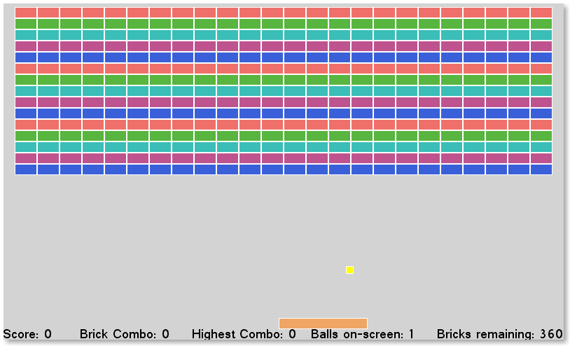
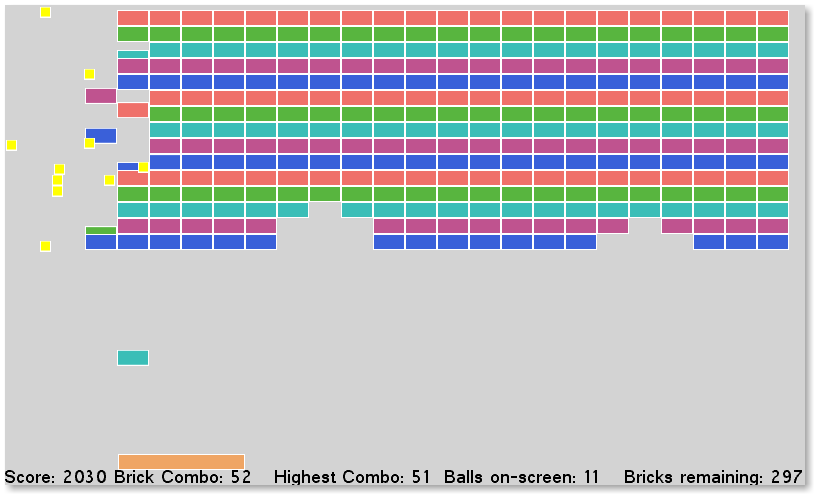
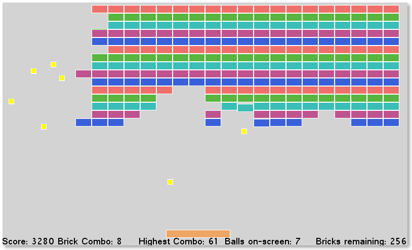

Breakout
===================

C# XNA/Monogame game
This is a simple remake of the classic game Breakout in C# using XNA/Monogame (built against Monogame)

It features downwards accelerating bricks and combo balls!

Controls: Left and right arrow keys to move

TODO:

	-Port to LibGDX (Java)
	-Re-work paddle physics for finer ball control
	-Powerups
	-Add sounds
	-Menu/Pause

Screenshots:

